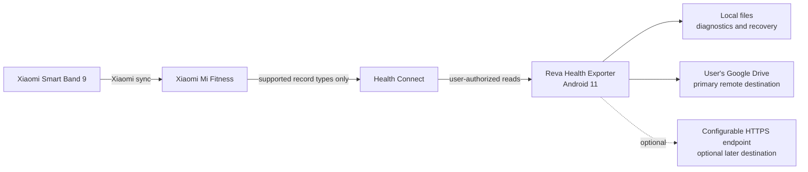
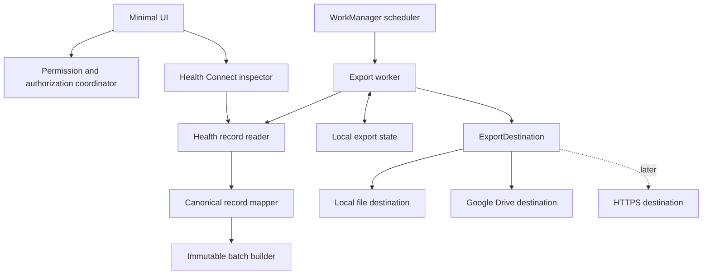
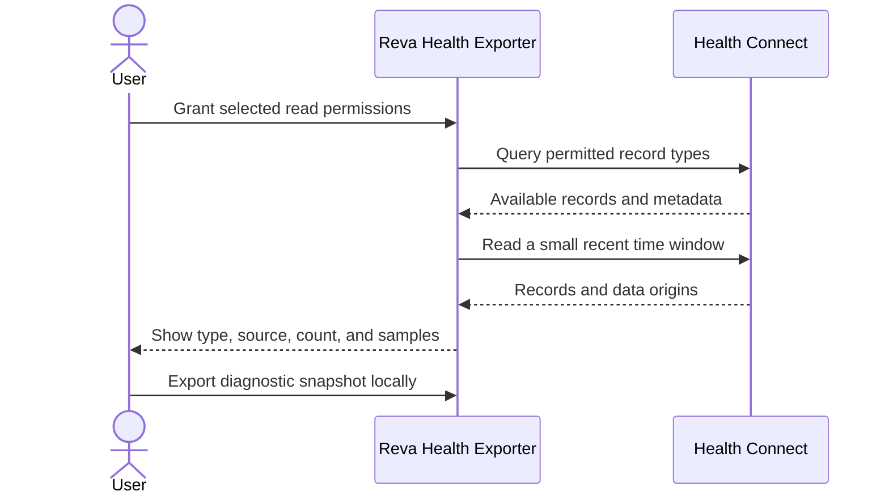
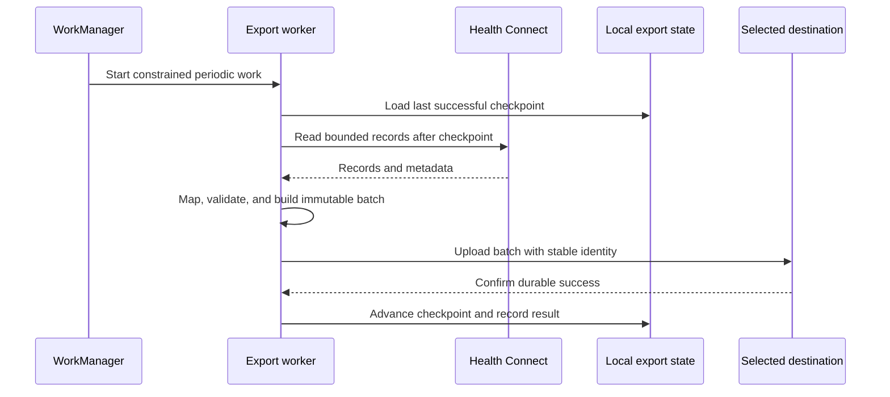

# Reva Health Exporter architecture

## Purpose

Reva Health Exporter is a private, sideloaded Android 11 application that inspects and exports Xiaomi Smart Band 9 data made available by Xiaomi Mi Fitness through Health Connect.

The project follows a diagnostic-first approach. The initial application proves which records Mi Fitness actually exposes. Export destinations are added only after that evidence is available.

## System context



The boundary between Mi Fitness and Health Connect is the main project risk. A metric visible in Mi Fitness is not necessarily available to this application.

## Android application components



### Responsibilities

| Component | Responsibility |
|---|---|
| Minimal UI | Show permissions, discovered data, recent records, destination settings, last export, and errors requiring user action. |
| Permission coordinator | Request Health Connect permissions and interactive Google authorization without mixing those flows into background work. |
| Health Connect inspector | Probe supported record types, contributing sources, time coverage, and recent sample records. |
| Health record reader | Read a bounded time window or incremental changes from Health Connect. |
| Canonical record mapper | Convert supported Health Connect records into a small versioned application format. |
| Immutable batch builder | Produce retry-safe NDJSON batches with stable metadata and no in-place append requirement. |
| Local export state | Store checkpoints, batch status, destination configuration, and non-secret diagnostic state. |
| WorkManager worker | Perform constrained periodic exports, retry transient failures, and surface authorization failures to the UI. |
| Export destination | Keep storage-specific behavior outside the Health Connect pipeline. |

## Diagnostic phase



The diagnostic phase must answer:

- Which requested Health Connect record types contain data?
- Does record metadata identify Mi Fitness or the expected device as the source?
- What history, granularity, and timestamps are available?
- Are important fields missing or transformed?
- Can the same records be read when WorkManager runs in the background?

No metric is considered supported until it is observed on the target phone.

## Export phase



The checkpoint advances only after the destination confirms success. Daily snapshots use an identity derived from destination, account, persisted timezone, and local date, so retries and refreshes update the same Drive file rather than creating duplicates.

## Export destination contract

The precise Kotlin API will be decided during implementation, but the boundary should remain conceptually small:

```kotlin
interface ExportDestination {
    suspend fun verifyConfiguration(): DestinationStatus
    suspend fun upload(batch: ExportBatch): UploadResult
}
```

Initial implementations:

1. `LocalFileDestination` for diagnostics, manual inspection, and recovery.
2. `GoogleDriveDestination` for user-owned remote storage.
3. `HttpsDestination` only when server-side ingestion is actually needed.

## Google Drive layout

Use a visible app-created folder and the narrow `drive.file` OAuth scope. Files are named `YYYY-MM-DD.json` and are mutable snapshots; consumers replace rows from a changed daily identity. Do not use the hidden Drive application-data folder for health exports because users and other tools must be able to inspect and copy their data.

Suggested layout:

```text
Reva Health Exporter/
  schema-v1/
    2026/
      08/
        2026-08-29T000000Z--2026-08-30T000000Z--<batch-id>.ndjson.gz
```

Use compressed immutable batches instead of appending to a remote file. Each batch contains:

- schema version;
- pseudonymous installation identifier;
- export creation time;
- covered time range;
- record type and source metadata;
- canonical health records.

See [docs/schema-v1.md](docs/schema-v1.md) for the full specification of Schema Version 1, field definitions, canonical units, and validation rules.

Google access is authorized interactively. If authorization is revoked or requires renewed user consent, background work stops safely and the UI asks the user to reconnect; a worker must never attempt to present an authorization screen.

## Security and privacy boundaries

- The application reads only permissions explicitly granted through Health Connect.
- Health records remain on the phone until the user enables an export destination.
- Google Drive exports belong to the signed-in user; the project does not operate a central health-data store.
- HTTPS destinations must use TLS and must not embed permanent server or AWS credentials in the application.
- Secrets and access tokens must not appear in source control, exported diagnostics, or ordinary logs.
- Logs should contain counts, time windows, record types, and error categories rather than health values.
- Deletion, retention, and optional client-side encryption require explicit product decisions before broader distribution.

## Failure behavior

| Failure | Behavior |
|---|---|
| Mi Fitness exposes no requested records | Report the absence as a diagnostic result; do not infer that the band collected no data. |
| Health Connect permission missing | Pause the affected operation and direct the user to the permission screen. |
| Google authorization revoked | Stop Drive exports without losing the checkpoint and request interactive reconnection. |
| Network unavailable or server error | Preserve the pending batch and let WorkManager retry with backoff. |
| Invalid destination configuration | Fail without advancing the checkpoint and show an actionable configuration error. |
| Partial or uncertain upload | Retry with the same stable batch identity. |
| Unsupported record type | Preserve diagnostic metadata, skip export by policy, and do not silently reinterpret it. |

## Delivery sequence

1. Scaffold the minimal Kotlin Android 11 application.
2. Implement Health Connect availability and permission checks.
3. Enumerate relevant record types, origins, counts, and recent samples.
4. Add local diagnostic export in the canonical format.
5. Validate actual Mi Fitness data on the target phone.
6. Introduce the destination boundary and Google Drive export.
7. Add WorkManager scheduling, checkpoints, retry behavior, and status UI.
8. Add a configurable HTTPS destination only if a concrete server-side use case appears.

## Explicit non-goals

- Direct Bluetooth communication with the band.
- Reverse-engineering Xiaomi protocols.
- A central analytics platform or dashboard.
- Cross-user access to health records.
- Supporting other wearable ecosystems before the Smart Band 9 path is validated.
