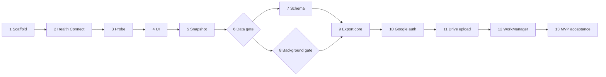

# Reva Health Exporter roadmap

This roadmap splits the MVP into independently verifiable GitHub issues. Each issue must produce observable evidence; implementation is not complete merely because code exists.

## Working rules

- Complete issues in dependency order.
- Keep every issue small enough to review and verify independently.
- Implement every issue in a dedicated `issue-<number>-<short-slug>` branch and one dedicated pull request.
- Branch from the latest `main` after prerequisite issues merge; never implement directly on `main`.
- Put `Closes #<number>` in the pull-request description; merging is performed manually by the user after required tests and checks pass.
- Create a follow-up issue rather than mixing newly discovered unrelated scope into the current pull request.
- Write the failing test or executable verification before implementing behavior.
- Follow [TESTING.md](TESTING.md); its completion rule applies to every issue.
- Use synthetic health values in tests and repository fixtures.
- Never commit personal health records, access tokens, credentials, or raw device diagnostics.
- Treat empty Health Connect results as evidence of no accessible records, not evidence that the band collected nothing.
- Do not build the remote uploader until the real-device diagnostic gate passes.

Health Connect does not expose a universal operation that enumerates every possible record type. The application maintains a candidate type catalog, queries each type, and reports whether it is accessible, empty, unsupported, or failed.

## Milestone: Diagnostic

### 1. Scaffold the Android 11 application

**Outcome:** A minimal installable Kotlin app named **Reva Health Exporter**.

**Required tests:**

- Gradle unit-test smoke test and manifest/resource assertions.
- API 30 instrumented launch test that verifies the application label and first screen.
- CI proof that unit tests, lint, assembly, and API 30 instrumentation run from a clean checkout.

**Acceptance criteria:**

- [ ] The project uses Kotlin and has one Android application module.
- [ ] `minSdk` is 30 and the application ID is stable and unique.
- [ ] The launcher displays `Reva Health Exporter`.
- [ ] `./gradlew test lintDebug assembleDebug` passes.
- [ ] The debug APK installs and opens on Android 11.
- [ ] GitHub Actions runs the same checks successfully.

### 2. Detect Health Connect and manage read permissions

**Outcome:** The app reports Health Connect readiness and requests only selected read permissions.

**Required tests:**

- Parameterized unit tests for available, unavailable, and update-required provider states.
- Permission-state tests for none, partial, all, denial, and revocation.
- UI tests for every resulting message and action.
- Physical Android 11 grant, deny, and revoke scenarios.

**Acceptance criteria:**

- [ ] Available, unavailable, and provider-update-required states are handled.
- [ ] Required package visibility and permission declarations are present.
- [ ] Granted and missing permissions are visible in the UI.
- [ ] Denial leaves the app usable and explains the limitation.
- [ ] Automated tests cover all availability states.
- [ ] Permission grant and denial are verified on the Android 11 phone.

### 3. Implement the candidate Health Connect record probe

**Outcome:** The app determines which expected record types contain accessible recent data.

Initial candidates include steps, heart rate, resting heart rate, sleep, distance, calories, exercise sessions, and oxygen saturation when supported by the installed provider.

**Required tests:**

- `FakeHealthConnectClient` tests for every candidate type, empty data, and multiple origins.
- Pagination tests including failure or expired token after a successful page.
- Tests for partial permission, API exception, cancellation, and one-type failure isolation.
- Time-window tests at exact boundaries, midnight, and daylight-saving transitions.

**Acceptance criteria:**

- [ ] Each candidate type is queried over a bounded configurable time window.
- [ ] Pagination is handled.
- [ ] Results include status, count, oldest and newest timestamps, and data origins.
- [ ] Unsupported, permission-missing, empty, and failed states remain distinct.
- [ ] One failing type does not abort the full diagnostic run.
- [ ] Unit tests cover populated, empty, paginated, and failed reads.
- [ ] Ordinary logs contain no raw health values.

### 4. Build the diagnostic results UI

**Outcome:** A user can inspect Health Connect results without reading application logs.

**Required tests:**

- View-model or presenter tests for every diagnostic screen state.
- Semantic UI tests for refresh, time-window selection, preview opt-in, and recoverable errors.
- Lifecycle recreation test preserving the last valid state.
- Accessibility assertions for labels and actionable controls.

**Acceptance criteria:**

- [ ] Every candidate type has a summary showing status, count, time coverage, and origins.
- [ ] Loading, empty, success, permission-denied, and error states are represented.
- [ ] A limited record preview requires explicit user action.
- [ ] The user can refresh and select a diagnostic time window.
- [ ] Recreation of the activity does not corrupt displayed state.
- [ ] A physical-device screenshot demonstrates the completed summary.

### 5. Export a sanitized local diagnostic snapshot

**Outcome:** The user can save diagnostic evidence without enabling cloud export.

**Required tests:**

- Deterministic serializer and golden-fixture tests using synthetic data.
- Document-output tests for success, cancellation, unavailable destination, and write failure.
- Parsing test for the produced file and negative tests for malformed input.
- Privacy assertion that forbidden raw-value, token, and credential fields are absent by default.

**Acceptance criteria:**

- [ ] Android's document picker is used for the destination.
- [ ] Output includes schema version, app version, Android version, permissions, type statuses, counts, origins, and time coverage.
- [ ] Raw health values are excluded by default.
- [ ] The produced JSON parses successfully outside the app.
- [ ] A golden-file test uses synthetic data.
- [ ] Output contains no token, credential, or unnecessary account identifier.

### 6. Validate Mi Fitness data on the real Android 11 phone

**Outcome:** We know which Smart Band 9 metrics Mi Fitness actually exposes through Health Connect.

**Required tests:**

- Execute a written physical-device protocol twice for both 24-hour and seven-day windows.
- Cross-check source, count, and time coverage against Health Connect or its Toolbox without recording personal values.
- Repeat after Mi Fitness resynchronization and after phone restart.
- Record every unautomatable claim as sanitized evidence or `UNVERIFIED`.

**Acceptance criteria:**

- [ ] Mi Fitness has synchronized recent walking, heart-rate, and sleep data where available.
- [ ] Diagnostics are run for 24-hour and seven-day windows.
- [ ] Every candidate type is classified as confirmed, empty, unavailable, permission blocked, or inconclusive.
- [ ] Source package, count, time coverage, and granularity are recorded without personal measurements.
- [ ] The diagnostic is repeated after a phone restart.
- [ ] A sanitized compatibility report is committed.
- [ ] The report contains an explicit proceed, narrow-scope, or stop decision.

**Gate:** Full export work starts only if the required data is confirmed.

## Milestone: Export Core

### 7. Define the versioned health-export schema

**Outcome:** Confirmed Health Connect types have a stable portable representation.

**Required tests:**

- Mapper tests for every confirmed type, optional-field combination, and unit conversion.
- Boundary and generated-data tests for timestamps, ranges, numeric limits, and ordering.
- Deterministic serialization, round-trip, gzip, malformed-input, and schema-rejection tests.
- Frozen version-1 compatibility fixtures that future versions must continue to read or explicitly migrate.

**Acceptance criteria:**

- [ ] The format defines schema version, pseudonymous installation ID, batch ID, creation time, covered time window, record type, origin, and canonical values.
- [ ] UTC timestamps and relevant source zone offsets have defined semantics.
- [ ] NDJSON or a JSON envelope is selected and documented.
- [ ] Gzip output is supported.
- [ ] Every confirmed type has a synthetic fixture and mapper test.
- [ ] Invalid records fail with a specific validation error.
- [ ] A compressed batch can be independently decompressed and validated.

### 8. Verify background Health Connect access on Android 11

**Outcome:** We know whether unattended reads work on the target phone.

**Required tests:**

- Unit tests for feature available, unavailable, permission missing, permission revoked, and API failure.
- Worker tests with a fake Health Connect client for success, retryable failure, and user-action-required outcomes.
- Physical-device tests with the app backgrounded, process removed, and phone restarted.
- Assert that no background path attempts to launch permission UI.

**Acceptance criteria:**

- [ ] The background-read feature status is checked before enabling the feature.
- [ ] Background permission is requested only when supported.
- [ ] A temporary manually triggered worker reads confirmed types while the app is not foregrounded.
- [ ] Unsupported devices show an explicit limitation.
- [ ] Permission revocation produces a user-action-required result.
- [ ] The test is repeated after restarting the phone.
- [ ] The compatibility report records the result without health values.

**Gate:** If background reads are unavailable, the product switches to user-triggered export.

### 9. Implement immutable batching, checkpoints, and local destination

**Outcome:** Incremental export survives retry, failure, and application restart.

**Required tests:**

- Exhaustive state-transition tests for batch creation, pending, upload, confirmation, and checkpoint advancement.
- Failure injection before and after every persistence and destination boundary.
- Restart recovery tests for every durable intermediate state.
- Duplicate, out-of-order, overlapping-window, exact-boundary, and concurrent-trigger tests.
- Atomic local-write and corrupt-state recovery tests.

**Acceptance criteria:**

- [x] A small `ExportDestination` boundary separates storage from Health Connect reads.
- [x] Export batches are immutable and have stable identities.
- [x] Pending batches and the last confirmed checkpoint persist locally.
- [x] The checkpoint advances only after durable destination success.
- [x] `LocalFileDestination` writes a valid batch.
- [x] A simulated failure followed by retry reuses the same batch identity.
- [x] Restarting between creation and confirmation does not lose the pending batch.
- [x] Tests cover duplicate records and exact time-window boundaries.

## Milestone: Google Drive

### 10. Configure narrow Google Drive authorization

**Outcome:** A user can connect, reconnect, and disconnect Google Drive access.

**Required tests:**

- Authorization-coordinator tests for success, cancellation, denial, revocation, reconnect, and account switch.
- UI tests verifying authorization is only launched by an explicit user action.
- Scope assertion that rejects broader Drive scopes.
- Live tests with two dedicated accounts and a repository/token scan after setup.

**Acceptance criteria:**

- [ ] The Google Cloud project has an Android OAuth client for the stable application ID and signing fingerprints.
- [ ] The app requests only the `drive.file` scope.
- [ ] Connect, reconnect, and disconnect are explicit user actions.
- [ ] Cancelling authorization does not break local export.
- [ ] Revoked authorization becomes a user-action-required state.
- [ ] Authorization UI is never launched by a background worker.
- [ ] No client secret or access token exists in source control or logs.

### 11. Upload retry-safe immutable batches to Google Drive

**Outcome:** A manually triggered batch appears in the user's visible Drive folder.

**Required tests:**

- Fake-gateway contract tests for folder absent, folder present, and duplicate folders.
- Upload tests for success, authorization failure, forbidden access, rate limit, transient server error, and timeout.
- Indeterminate-success test where upload succeeds but its response is lost.
- Idempotency, account isolation, downloaded-gzip, and schema-validation tests.
- Live retry test using only synthetic data in dedicated accounts.

**Acceptance criteria:**

- [x] The app creates or locates the visible `Reva Health Exporter/schema-v1/...` hierarchy.
- [x] Compressed immutable batches are uploaded with stable identities.
- [x] Drive `appProperties` or pre-generated IDs support duplicate detection.
- [x] Downloaded output decompresses and passes schema validation.
- [x] Retrying the same batch creates no second logical batch.
- [x] Network or authorization failure does not advance the checkpoint.
- [x] Two test accounts receive exports only in their own Drives.

## Milestone: Android 11 MVP

### 12. Schedule reliable periodic export with WorkManager

**Outcome:** Confirmed records export without opening the app.

**Required tests:**

- Worker unit tests for success, retry, permanent failure, and user-action-required outcomes.
- WorkManager integration tests for constraints, unique periodic work, cancellation, and interval triggering using official test helpers.
- Concurrency test for periodic work and `Export now` starting together.
- Offline-to-online recovery and retry/backoff configuration tests.
- Physical-device persistence checks after process removal and reboot; never sleep through a real interval in automated tests.

**Acceptance criteria:**

- [ ] Unique periodic work prevents duplicate schedules.
- [ ] Appropriate network and battery constraints are applied.
- [ ] Transient failures retry with backoff.
- [ ] Permanent and user-action-required failures do not create infinite retry loops.
- [ ] The UI shows the last result and current export state without promising an exact next execution time.
- [ ] An `Export now` action uses one-time work through the same pipeline.
- [ ] Offline execution succeeds after connectivity returns.
- [ ] Successful export advances the checkpoint exactly once.
- [ ] Work remains scheduled after app and device restart.
- [ ] Automated worker tests do not wait for a real periodic interval.

### 13. Complete Android 11 end-to-end acceptance and signed APK

**Outcome:** A reproducible sideloadable MVP is ready for personal use.

**Required tests:**

- Full automated suite from a clean checkout, including API 30 instrumentation and coverage gates.
- Scripted clean-install and upgrade journeys on the physical Android 11 phone.
- End-to-end happy path plus permission revocation, Drive revocation, offline recovery, account switch, and corrupt local-state scenarios.
- Validate every exported artifact and inspect logs/build outputs for health values and credentials.
- Repeat the release journey using the signed, minified APK rather than the debug build.

**Acceptance criteria:**

- [ ] A clean Android 11 install completes permissions, diagnostics, local export, Drive connection, immediate export, and periodic export.
- [ ] New band data produces a new valid Drive batch after Mi Fitness synchronization.
- [ ] Revoked Drive authorization is detected and recovered safely.
- [ ] All automated checks pass.
- [ ] Exported files validate against schema version 1.
- [ ] No personal health fixture, credential, or token is committed.
- [ ] A signed APK is produced using documented reproducible steps.
- [ ] The README documents installation, permissions, limitations, export ownership, and deletion.
- [ ] Known Mi Fitness compatibility findings are linked.

## Dependency order

## Deferred backlog

- Configurable HTTPS destination.
- Client-side encryption.
- Retention and cleanup policies.
- Additional wearable ecosystems.
- Central dashboards or analytics.
- Public distribution and wider OAuth verification.
