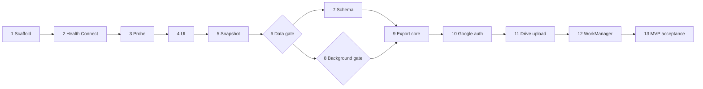

# Reva Health Exporter roadmap

This roadmap splits the MVP into independently verifiable GitHub issues. Each issue must produce observable evidence; implementation is not complete merely because code exists.

## Working rules

- Complete issues in dependency order.
- Keep every issue small enough to review and verify independently.
- Use synthetic health values in tests and repository fixtures.
- Never commit personal health records, access tokens, credentials, or raw device diagnostics.
- Treat empty Health Connect results as evidence of no accessible records, not evidence that the band collected nothing.
- Do not build the remote uploader until the real-device diagnostic gate passes.

Health Connect does not expose a universal operation that enumerates every possible record type. The application maintains a candidate type catalog, queries each type, and reports whether it is accessible, empty, unsupported, or failed.

## Milestone: Diagnostic

### 1. Scaffold the Android 11 application

**Outcome:** A minimal installable Kotlin app named **Reva Health Exporter**.

**Acceptance criteria:**

- [ ] The project uses Kotlin and has one Android application module.
- [ ] `minSdk` is 30 and the application ID is stable and unique.
- [ ] The launcher displays `Reva Health Exporter`.
- [ ] `./gradlew test lintDebug assembleDebug` passes.
- [ ] The debug APK installs and opens on Android 11.
- [ ] GitHub Actions runs the same checks successfully.

### 2. Detect Health Connect and manage read permissions

**Outcome:** The app reports Health Connect readiness and requests only selected read permissions.

**Acceptance criteria:**

- [ ] Available, unavailable, and provider-update-required states are handled.
- [ ] Required package visibility and permission declarations are present.
- [ ] Granted and missing permissions are visible in the UI.
- [ ] Denial leaves the app usable and explains the limitation.
- [ ] Automated tests cover all availability states.
- [ ] Permission grant and denial are verified on the Android 11 phone.

### 3. Implement the candidate Health Connect record probe

**Outcome:** The app determines which expected record types contain accessible recent data.

Initial candidates include steps, heart rate, resting heart rate, sleep, distance, calories, exercise sessions, and oxygen saturation when supported by the installed provider.

**Acceptance criteria:**

- [ ] Each candidate type is queried over a bounded configurable time window.
- [ ] Pagination is handled.
- [ ] Results include status, count, oldest and newest timestamps, and data origins.
- [ ] Unsupported, permission-missing, empty, and failed states remain distinct.
- [ ] One failing type does not abort the full diagnostic run.
- [ ] Unit tests cover populated, empty, paginated, and failed reads.
- [ ] Ordinary logs contain no raw health values.

### 4. Build the diagnostic results UI

**Outcome:** A user can inspect Health Connect results without reading application logs.

**Acceptance criteria:**

- [ ] Every candidate type has a summary showing status, count, time coverage, and origins.
- [ ] Loading, empty, success, permission-denied, and error states are represented.
- [ ] A limited record preview requires explicit user action.
- [ ] The user can refresh and select a diagnostic time window.
- [ ] Recreation of the activity does not corrupt displayed state.
- [ ] A physical-device screenshot demonstrates the completed summary.

### 5. Export a sanitized local diagnostic snapshot

**Outcome:** The user can save diagnostic evidence without enabling cloud export.

**Acceptance criteria:**

- [ ] Android's document picker is used for the destination.
- [ ] Output includes schema version, app version, Android version, permissions, type statuses, counts, origins, and time coverage.
- [ ] Raw health values are excluded by default.
- [ ] The produced JSON parses successfully outside the app.
- [ ] A golden-file test uses synthetic data.
- [ ] Output contains no token, credential, or unnecessary account identifier.

### 6. Validate Mi Fitness data on the real Android 11 phone

**Outcome:** We know which Smart Band 9 metrics Mi Fitness actually exposes through Health Connect.

**Acceptance criteria:**

- [ ] Mi Fitness has synchronized recent walking, heart-rate, and sleep data where available.
- [ ] Diagnostics are run for 24-hour and seven-day windows.
- [ ] Every candidate type is classified as confirmed, empty, unavailable, permission blocked, or inconclusive.
- [ ] Source package, count, time coverage, and granularity are recorded without personal measurements.
- [ ] The diagnostic is repeated after a phone restart.
- [ ] A sanitized compatibility report is committed.
- [ ] The report contains an explicit proceed, narrow-scope, or stop decision.

**Gate:** Full export work starts only if the required data is confirmed.

## Milestone: Export Core

### 7. Define the versioned health-export schema

**Outcome:** Confirmed Health Connect types have a stable portable representation.

**Acceptance criteria:**

- [ ] The format defines schema version, pseudonymous installation ID, batch ID, creation time, covered time window, record type, origin, and canonical values.
- [ ] UTC timestamps and relevant source zone offsets have defined semantics.
- [ ] NDJSON or a JSON envelope is selected and documented.
- [ ] Gzip output is supported.
- [ ] Every confirmed type has a synthetic fixture and mapper test.
- [ ] Invalid records fail with a specific validation error.
- [ ] A compressed batch can be independently decompressed and validated.

### 8. Verify background Health Connect access on Android 11

**Outcome:** We know whether unattended reads work on the target phone.

**Acceptance criteria:**

- [ ] The background-read feature status is checked before enabling the feature.
- [ ] Background permission is requested only when supported.
- [ ] A temporary manually triggered worker reads confirmed types while the app is not foregrounded.
- [ ] Unsupported devices show an explicit limitation.
- [ ] Permission revocation produces a user-action-required result.
- [ ] The test is repeated after restarting the phone.
- [ ] The compatibility report records the result without health values.

**Gate:** If background reads are unavailable, the product switches to user-triggered export.

### 9. Implement immutable batching, checkpoints, and local destination

**Outcome:** Incremental export survives retry, failure, and application restart.

**Acceptance criteria:**

- [ ] A small `ExportDestination` boundary separates storage from Health Connect reads.
- [ ] Export batches are immutable and have stable identities.
- [ ] Pending batches and the last confirmed checkpoint persist locally.
- [ ] The checkpoint advances only after durable destination success.
- [ ] `LocalFileDestination` writes a valid batch.
- [ ] A simulated failure followed by retry reuses the same batch identity.
- [ ] Restarting between creation and confirmation does not lose the pending batch.
- [ ] Tests cover duplicate records and exact time-window boundaries.

## Milestone: Google Drive

### 10. Configure narrow Google Drive authorization

**Outcome:** A user can connect, reconnect, and disconnect Google Drive access.

**Acceptance criteria:**

- [ ] The Google Cloud project has an Android OAuth client for the stable application ID and signing fingerprints.
- [ ] The app requests only the `drive.file` scope.
- [ ] Connect, reconnect, and disconnect are explicit user actions.
- [ ] Cancelling authorization does not break local export.
- [ ] Revoked authorization becomes a user-action-required state.
- [ ] Authorization UI is never launched by a background worker.
- [ ] No client secret or access token exists in source control or logs.

### 11. Upload retry-safe immutable batches to Google Drive

**Outcome:** A manually triggered batch appears in the user's visible Drive folder.

**Acceptance criteria:**

- [ ] The app creates or locates the visible `Reva Health Exporter/schema-v1/...` hierarchy.
- [ ] Compressed immutable batches are uploaded with stable identities.
- [ ] Drive `appProperties` or pre-generated IDs support duplicate detection.
- [ ] Downloaded output decompresses and passes schema validation.
- [ ] Retrying the same batch creates no second logical batch.
- [ ] Network or authorization failure does not advance the checkpoint.
- [ ] Two test accounts receive exports only in their own Drives.

## Milestone: Android 11 MVP

### 12. Schedule reliable periodic export with WorkManager

**Outcome:** Confirmed records export without opening the app.

**Acceptance criteria:**

- [ ] Unique periodic work prevents duplicate schedules.
- [ ] Appropriate network and battery constraints are applied.
- [ ] Transient failures retry with backoff.
- [ ] Permanent and user-action-required failures do not create infinite retry loops.
- [ ] The UI shows the last result and current export state without promising an exact next execution time.
- [ ] An `Export now` action uses one-time work through the same pipeline.
- [ ] Offline execution succeeds after connectivity returns.
- [ ] Successful export advances the checkpoint exactly once.
- [ ] Work remains scheduled after app and device restart.
- [ ] Automated worker tests do not wait for a real periodic interval.

### 13. Complete Android 11 end-to-end acceptance and signed APK

**Outcome:** A reproducible sideloadable MVP is ready for personal use.

**Acceptance criteria:**

- [ ] A clean Android 11 install completes permissions, diagnostics, local export, Drive connection, immediate export, and periodic export.
- [ ] New band data produces a new valid Drive batch after Mi Fitness synchronization.
- [ ] Revoked Drive authorization is detected and recovered safely.
- [ ] All automated checks pass.
- [ ] Exported files validate against schema version 1.
- [ ] No personal health fixture, credential, or token is committed.
- [ ] A signed APK is produced using documented reproducible steps.
- [ ] The README documents installation, permissions, limitations, export ownership, and deletion.
- [ ] Known Mi Fitness compatibility findings are linked.

## Dependency order

## Deferred backlog

- Configurable HTTPS destination.
- Client-side encryption.
- Retention and cleanup policies.
- Additional wearable ecosystems.
- Central dashboards or analytics.
- Public distribution and wider OAuth verification.
