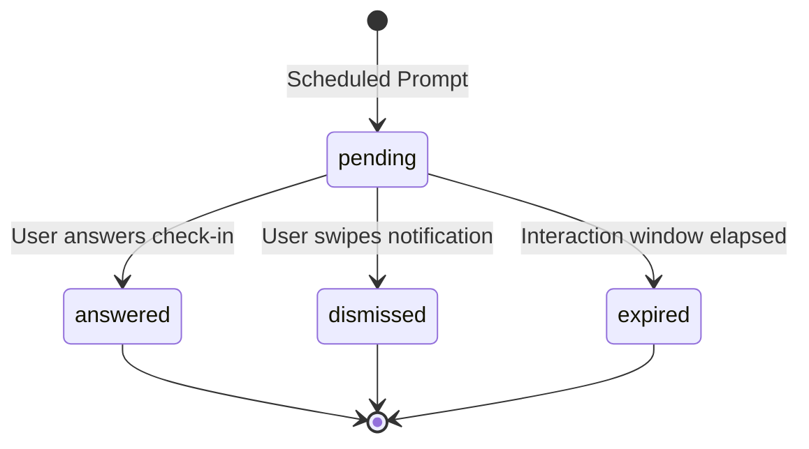

# Reva Export Envelope Version 1 (v1)

This specification defines the top-level machine-readable JSON contract used by Reva Health Exporter to deliver combined Health Connect records and Reva Ecological Momentary Assessment (EMA) check-in events to backend ingestion pipelines.

The formal schema definition is published in [`docs/export-envelope-v1.schema.json`](export-envelope-v1.schema.json).

---

## 1. Motivation and Domain Separation

Reva collects two distinct categories of health and subjective well-being observations:

1. **Objective Physiological Data (`healthConnectBatch`):**
   - Measurements synced from wearable sensors (e.g. Xiaomi Smart Band 9 via Xiaomi companion apps and Health Connect).
   - Metrics include steps, heart rate series, sleep stages, distance, energy, and workout sessions (`exercise_session`).
   - Sourced strictly from verified companion package origins (`com.xiaomi.wearable` and `com.google.android.apps.fitness`).

2. **Subjective Self-Reported Data (`emaEvents`):**
   - In-the-moment user self-reports collected via experience-sampling notification prompts.
   - Metrics include 1–5 Likert scale responses for mood, energy, focus, and stress, current activity classification, and optional freeform notes.
   - Preserves state lifecycle semantics (`pending`, `answered`, `dismissed`, `expired`).

To maintain scientific integrity and prevent invalid correlation assumptions, **EMA observations are never mapped to Health Connect records or aggregated into physiological batches**. The combined export envelope preserves both as separate, versioned top-level arrays.

---

## 2. Envelope Specification

### Top-Level Document Structure

Each export file (such as a Google Drive daily snapshot `YYYY-MM-DD.json`) conforms to the following envelope shape:

```json
{
  "exportSchemaVersion": 1,
  "exportId": "00000000-0000-4000-8000-000000000001",
  "createdAt": "2026-09-24T22:00:00Z",
  "healthConnectBatch": {
    "schemaVersion": 1,
    "header": {
      "schemaVersion": 1,
      "installationId": "00000000-0000-4000-8000-000000000001",
      "batchId": "00000000-0000-4000-8000-000000000001",
      "createdAt": "2026-09-24T22:00:00Z",
      "timeWindow": {
        "startInclusive": "2026-09-24T00:00:00Z",
        "endExclusive": "2026-09-25T00:00:00Z"
      },
      "recordCount": 3,
      "recordTypes": [
        "exercise_session",
        "heart_rate",
        "steps"
      ],
      "exportDate": "2026-09-24",
      "exportTimezone": "Europe/Moscow"
    },
    "records": [ ... ]
  },
  "emaEvents": [ ... ]
}
```

### Top-Level Fields

| Field | Type | Required | Description |
| :--- | :--- | :--- | :--- |
| `exportSchemaVersion` | Integer | Yes | Envelope schema version (must be `1`). |
| `exportId` | String | Yes | Unique batch identifier (stable UUID or daily snapshot identity). |
| `createdAt` | String | Yes | ISO-8601 UTC timestamp (`YYYY-MM-DDTHH:MM:SSZ`) when the export was generated. |
| `healthConnectBatch` | Object | Yes | Health Connect payload containing `schemaVersion`, optional `header`, and `records`. |
| `emaEvents` | Array | Yes | Answered EMA events confirmed by this export. Their scheduled dates may precede the Health Connect time window if they were answered after an earlier export. |

---

## 3. Health Connect Records & Workout Sessions

### Trusted Origin Policy
To guarantee provenance and prevent duplicated double-counting, records are filtered by explicit allowed package origins defined in `ExportSourcePolicy`:

| Record Type | Allowed Origin Package | Description |
| :--- | :--- | :--- |
| `steps` | `com.xiaomi.wearable` | Smart Band 9 step cadence intervals |
| `heart_rate` | `com.xiaomi.wearable` | Smart Band 9 continuous heart rate samples |
| `sleep_session` | `com.xiaomi.wearable` | Smart Band 9 sleep cycles and stages |
| `oxygen_saturation` | `com.xiaomi.wearable` | Smart Band 9 SpO2 records |
| `exercise_session` | `com.xiaomi.wearable` | Smart Band 9 active workout sessions |
| `distance` | `com.google.android.apps.fitness` | Derived distance measurements |
| `total_calories_burned` | `com.google.android.apps.fitness` | Derived energy expenditure |

### Workout Session Structure (`exercise_session`)
Workout sessions recorded on the Smart Band 9 (e.g. Walking, Running, Stretching, Strength training) are exported with:
- `startTime`, `endTime`, `startZoneOffset`, `endZoneOffset`
- `exerciseType`: Health Connect integer constant (e.g. `79` for walking, `56` for running, `0` for other/unknown)
- `title`: Optional session title (if provided by companion app sync)
- `segments`: Optional segmented intervals with `segmentType` and `repetitions`
- `laps`: Optional split laps with `lengthMeters`

Workout sessions are optional; batches without tracked workouts remain valid with empty workout lists.

---

## 4. EMA Event Contract & Upsert Semantics

### Identity and Upsert Key
Every EMA event possesses a stable identifier (`id`, e.g. `018f-example-event-001`).

**Backend Ingestion Invariant:**
- Ingestion must use `id` as the primary upsert key.
- Automatic exports include answered events not yet confirmed by a successful upload, even when their scheduled day is before the Health Connect window. Manual backfills include answered events for the selected day.
- Retried batches retain their batch identity, but refresh saved EMA entries from the local event store before upload so older pending or terminal states cannot be sent after an upgrade.
- A newer copy of an event with the same `id` **replaces** the previous event state. It must never create duplicate records or observations.

### Lifecycle Statuses and Field Constraints

EMA events progress through a strict finite state machine:
- `pending`: Prompt enqueued or shown to the user; awaiting response.
- `answered`: User completed the questionnaire.
- `dismissed`: User explicitly dismissed the notification prompt.
- `expired`: Prompt timed out without an interaction.



**Status Invariants:**
1. **`answered` events:**
   - Must contain `answeredAt`, `mood`, `energy`, `focus`, `stress`, and `activity`.
   - May contain `activityLabel`, `note` (up to 280 characters), and `additionalAnswers`.
2. **`pending`, `dismissed`, and `expired` events:**
   - Must **never** contain numeric ratings (`mood`, `energy`, etc.), `answeredAt`, `activity`, or `note`.
   - The backend must **never** treat dismissed or expired events as numeric zeroes or placeholder values in statistical aggregations.

---

## 5. Backward Compatibility and Migration

1. **Dual-Format Deserialization:**
   - The app's `ExportBatchSerializer.parseJson()` automatically supports both:
     - The new combined envelope (`exportSchemaVersion: 1`, `healthConnectBatch`, `emaEvents`).
     - The legacy schema-v1 daily snapshot format (`header`, `records`), populating `emaEvents = []`.
2. **Forward Compatibility:**
   - Backends must accept unknown optional fields (`additionalProperties: true`).
   - If an unsupported `exportSchemaVersion` or `schemaVersion` is encountered, backends must quarantine or reject the file rather than guessing payload schemas.

---

## 6. Physical Device Verification Protocol (Smart Band 9)

To verify end-to-end workout tracking and export on physical hardware:

1. **Band Activity Tracking:**
   - On the Xiaomi Smart Band 9, start an activity (e.g., Outdoor Walk or Stretching).
   - Exercise for at least 5 minutes, then end and save the workout on the band.
2. **Companion Synchronization:**
   - Open Xiaomi Mi Fitness and perform a pull-down sync until the new workout appears in the app history.
3. **Health Connect Verification:**
   - Open Android Health Connect -> Data and access -> `Exercise`.
   - Verify that the workout appears with data source `com.xiaomi.wearable`.
   - Note that some band activities (like stretching) may be stored with `exerciseType: 0` or default labels depending on the Mi Fitness release.
4. **Export Execution:**
   - In Reva Health Exporter, trigger manual backfill or wait for the scheduled background export.
   - Inspect the generated daily snapshot JSON (or Google Drive uploaded file).
   - Verify `healthConnectBatch.records` contains the `exercise_session` record with `origin: "com.xiaomi.wearable"`.
   - Verify `emaEvents` contains any EMA check-ins recorded for that calendar day.
