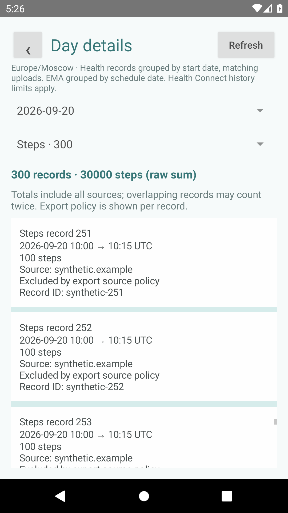

# Main upload matrix

Design source: Stitch project `5769176742869058112`, screen `4bd90a4b3ea848ec9ccb0ed75ffb0bb6` (Reva Health Exporter - Main Upload Matrix).

The Records page uses the reference palette, connection cards, export status, Monday-first five-week calendar, window navigation, and contextual selection bar. Dates and coverage come from the existing export history. Future dates cannot be selected. Selection and the current window survive activity recreation.

The old list, load-more button, timezone heading, diagnostics and background-probe controls are removed from Records. Existing connection management and manual full export are available under Vaults; diagnostic tools and the installed version are under Settings. Audit Log displays the latest recorded export summary; the app does not yet store a complete execution audit trail.

The mock email, record counts and encryption claim are not copied. Unknown inventory is labeled Unknown because an absent export does not establish that Health Connect has no records. Existing upload scheduling and export format are unchanged.

Verification: `./gradlew test lintDebug assembleDebug connectedDebugAndroidTest` on the API 30 emulator. Tests cover calendar boundaries, navigation, disabled future dates, selection/cancellation, disconnected upload gating, refresh, and recreation. No live account or physical-phone test is claimed for this presentation change.

## Selected-day details

Select one or more dates and tap **Details**. This works without a connected Drive account. The date selector is the top-level grouping; the type selector lists EMA, Sleep, Steps, Workouts, Heart rate, Resting heart rate, Distance, Calories and Oxygen saturation, with counts or read status. Both selectors and the selected group's aggregate stay fixed while only the record list scrolls. Back returns to the calendar with its selection preserved. Date, type, timezone and record scroll position survive recreation.

Details reads all accessible sources for the app's eight supported Health Connect types, not only export-allowed origins. It also reads all locally stored EMA statuses. Records show values, sample/stage/lap/segment details, timestamps, source IDs, available metadata and export-policy eligibility. It does not download or automatically compare Drive files.

Health records belong to the local calendar date of their start, using the same half-open day window as uploads (including daylight-saving transitions). Overnight sessions therefore appear on their start date in full. EMA uses its stored schedule date. Totals are raw sums across returned records and sources; overlaps may count twice. Sleep reports recorded asleep-stage time separately from full session duration. Missing stages do not imply zero sleep. Heart-rate groups show sample counts; resting heart rate and oxygen saturation show record averages. Every group shows a record count.

The reader consumes every page, isolates errors by type, distinguishes unavailable permissions/provider from successful empty reads, and rejects partial pagination failures. Health Connect history access limits still apply; a successful empty result does not prove the device collected no data. Refresh rereads the selected date. All loading occurs off the UI thread and older cancelled requests cannot replace the current date.

Verification for issue #71: `ANDROID_SERIAL=emulator-5554 ./gradlew test lintDebug assembleDebug koverVerifyDebug connectedDebugAndroidTest` passed 313 JVM tests and 50 API 30 tests (zero failed/skipped). New tests: `DayDetailsTest`, `HealthConnectDayDetailsReaderTest`, `DayDetailsUiTest`. They cover totals and field visibility, sources, pagination, boundary/DST handling, EMA statuses, errors/cancellation, 300-record scrolling, retry, recreation and calendar navigation. The screenshot below uses synthetic records only. No physical-phone data or live Drive access was needed or used for this read-only UI feature.

